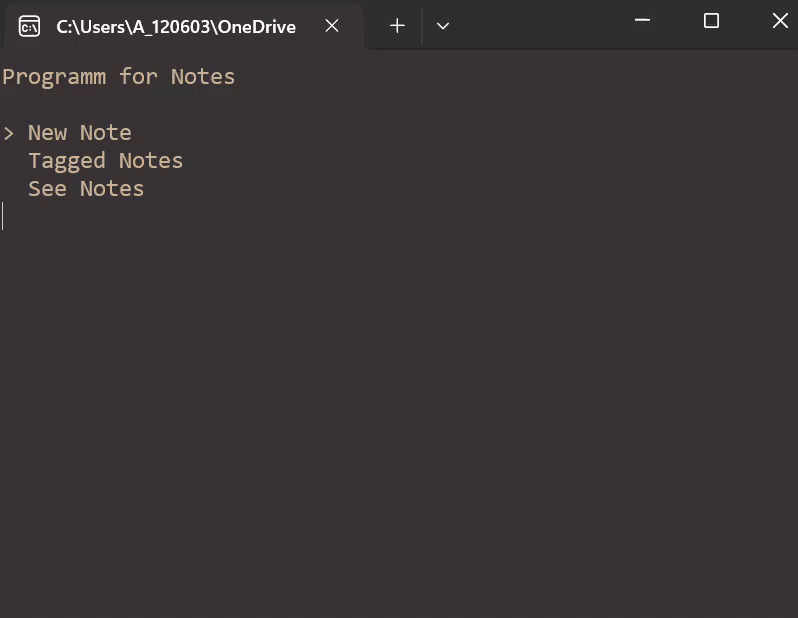

# Lern-Periode 4

Szymon Rybicki

20.2 bis 2.4.2024

## Grob-Planung

1. Wo stehen Sie mit Ihren Noten? In welchen Modulen waren Sie besonders stark; in welchen sind die ungenügend? Welche davon sind besonders wichtig?

Meine Noten sind gut. In Modul 319 ist es mir vorrallem gut gegangen. In Modul 117 geht es um Netzwerke, und ich habe nicht alle Aufgaben erfüllt, denke ich aber es ist nicht ein grosses Problem. Wichtig gerade ist das Modul 164, da letztes Mal Arbeit an denen war Anspruchsvoll, und der Abgabetermin ist übermorgen.

2. Was hatten Sie sich am Ende von LP3 vorgenommen? Was war Ihr VBV? Wie könnten Sie diesen besonders gut üben?

In Lerperiode 3 steht mein VBV nicht. Wahrscheinlich habe ich vergessen. In Reflexionteil steht aber etwas. Dass ich gegen Ende meiner Arbeit mich Zeit nehmen soll, um diese Arbeit auf schöneres Niveau zu bringen. Ich nehme das als mein VBV. Das kann ich gut üben, wenn ich eine Idee für Endprodukt habe.  

3. **Neu**: Was möchten Sie Neues lernen?

Ich möchte JSON lernen. Das heisst, ich möchte wieder die Struktur anschauen und  lernen, wie man Daten bekommen und speichern kann. 
/
Ich möchte ein Interaktives CLI mit C# erstellen. 

4. Was wäre ein geeignetes Projekt für diese LP4?

Für dieses LP möchte eine Console Applikation erstellen. Es hat ein schönes Menu, und man kann drinnen Notizen mit JSON erstellen. Mit Menu kann man alle Notizen anschauen. Diese Notizen kann man entweder anschauen oder editieren. Und man kann leicht neue Funktionen hinzufügen.

## 20.2.2024

Heute habe ich viel über mein Projekt nachgedacht. Am Anfang wollte ich sehr API mit Wetter API lernen, doch dann habe ich erfahren, dass es nicht kostenlos ist. Danach habe ich auf JSON entschieden. JSON, weil ich es schon versucht habe, und ich glaube es kommt oft vor. Ich habe auch gefunden, dass C# system.commandline hat. Ich habe keine Ahnung was das bedeutet, hoffe aber es kann mir helfen, Console Apps einfacher zu machen. (74)

## 27.2.2024

- [x] Einen Plan für den Projekt erstellen
- [x] 3 Ideen aus Gestalterischen Sicht erfinden
- [ ] Beispiele mit system.commandline anschauen und versuchen
- [ ] Projekt anfangangen und den einen Namen geben

| Testfall-Nummer | Ausgangslage (Given)                         | Eingabe (When)                                                  | Ausgabe (Then)                                                                 | Erfüllt? |
| --------------- | -------------------------------------------- | --------------------------------------------------------------- | ------------------------------------------------------------------------------ | -------- |
| 1               | Der Unterricht hat begonnen                  | Ich weiss nicht, was ich zu tun habe                            | Ich schaue plan nach                                                           | Ja       |
| 2               | Plan erstellt                                | Ich bekomme eine Idee, was ich in meiner Applikation haben will | Ich schreibe es auf, und versuche es zu visualisieren. Zb mit paint            | Ja       |
| 3               | Sachen mit Befehl ausprobiert                | -                                                               | Eine Ahnung haben, warum es funktioniert                                       | nein     |
| 4               | Eine Vorbereitung für den Projekt ist fertig | Projekt öffnen                                                  | "Hallo, hier wird mein Projekt unter der name ... gebaut" (Das später löschen) | nein     |

Heute habe ich mich viel mit Planung beschäftigt. In diese Lernperiode möchte ich ja etwas aus neu gelerntes erstellen, und ich kenne den Weg gar nicht. Ich wollte ausprobieren, wie man ein Projekt formal anfangen und durchführen kann, deshalb habe ich Projekt Notizen erstellt (Lernperiode/Files/). Plan zu erstellen und Ideen zusammenzufassen sind toll gegangen. Aber da ich mir auf neue Plan fokusiert habe, habe ich zwei Arbeitspaketen nicht erfüllt. 

## 05.03.2024

- [x] Planung Ändern - system.commandline löschen - es ist nicht, was ich brauche

- [x] Menu Funktionen und Speicher Funktionen als PAP visualisieren

- [ ] Funktion, die Pfeiltasten einlesen kann

- [ ] Eine Variable, die weisst, wo sich das Wahl in den Menu befindet

- [x] (JSON Struktur für Notizen erfinden, also was für Daten werden bei Notizen gespeichert)

- [x] (Titel und Menu in neuen Projekt als Text erstellen)

| Testfall-Nummer | Ausgangslage (Given)                         | Eingabe (When)        | Ausgabe (Then)                                            | Erfüllt? |
| --------------- | -------------------------------------------- | --------------------- | --------------------------------------------------------- | -------- |
| 1               | Alte Planung vorhanden                       |                       | system.commandline als Idee löschen.                      | Ja       |
| 2               | Eine Vorbereitung für den Projekt ist fertig | Projekt öffnen        | Program for Notes, Write new Note, Edit a Note, See notes | Ja       |
| 3               | Programm ist gestartet                       | Pfeiltaste nach unten | Eingelesen                                                | nein     |
| 4               | Programm ist gestartet, Variable = 0         | Pfeiltaste nach unten | Variable = 1                                              | nein     |

Heute habe ich mich mit vorallem mit Planung, dann noch mit Realisierung beschäftigt. Zuerst habe ich Projektplan am bisschen verändert.. Danach habe ich ein .pap Datei erstellt, damit ich weiss, wie das Programm Eingaben lesen soll. 
In der Projektplan gab es andere Dinge, die ich zuerst machen soll. Das waren nähmlich die .pap Datei und JSON-Struktur. Deswegen sind zwei Arbeitspackete verschoben. 
In VBV steht, dass ich alles auf besseres Niveau gegend Ende stellen soll. Schöner ist es nicht geworden, dafür habe ich mit Github branches gearbeitet und das Repo in VS  gemacht. Somit kann ich direkt Code editieren. (98)

## 12.03.2024

- [x] Funktion, die Pfeiltasten einlesen kann

- [x] Anstatt einfaches Text, ein Array mit diese Menu Optionen

- [x] ein Array, der als Platz für > (sichtbares Menu wähler) benutzt wird

- [ ] "New Note" Funktion, die für Eingaben wartet

| Testfall-Nummer | Ausgangslage (Given)                 | Eingabe (When)              | Ausgabe (Then)   | Erfüllt? |
| --------------- | ------------------------------------ | --------------------------- | ---------------- | -------- |
| 1               | Programm ist gestartet               | Pfeiltaste nach unten       | Eingelesen       | Ja       |
| 2               | Programm ist gestartet, Variable = 0 | Pfeiltaste nach unten       | Variable = -1    | Ja       |
| 3               | Programm gestartet                   | -                           | > bei Position 0 | Ja       |
| 4               | Programm gestartet                   | New Note Funktion aktiviert | Name: , Text:    | Nein     |

Heute ist mein Programm vorwärts gekommen.

Am Anfang habe ich Funktion erstellt, die Arrow Keys einlesen kann. Ich habe meine Vorlage für Probleme benutzt und habe ich mich auf diesen Problem anders konzentriert und es schnell gelöst.

Später kam ich auf keine Idee, wie ich dieses Menu darstellen kann. In text es zu überlegen, war schwierig, deshalb habe ich mir das an einer Tafel, die bei mir zu Hause ist, überlegt und wieder schnell gelöst.

Ich habe Probleme am Ende gehabt, da meine Arbeit auf Github nicht existierte. Da ich Github nicht gut kenne, entscheidete ich, alles manuel zu verschieben und prüfte, ob alles dabei war. (101)

## 19.03.2024

- [x] herausfinden, wie kann ich Github Code direkt in Visual Studio editieren und ausführen kann, so wie man Branches in Visual Studio wächselt

- [x] Ein Switch Case erstellen, der für Funktionen zuständig ist. Anhand von menuSelection

- [x] Notizen Funktion vorbereiten, d.h. alles wegläschen Nach Titel und Inhalt fragen

- [x] Nach Titel eingabe kann man Enter drücken, um nun inhalt zu schreiben

Heute ist alles zufällig gut gegangen.
Zuerst, mit vielen Versuchen, fand ich eine Methode, wie ich an den Code in Visual Studio direkt arbeiten und hochladen auf Github kann. Damit ich es nicht vergesse, erstellte ich mir ein Modell, ist in Project Files.

Danach ging alles leicht. Ohne Probleme funktionierte Switch Case, wie ich mir gedacht habe. Und mit Erfahrung mit Console.SetCursorPos löste ich die Gestaltung der Funktion.

Am Ende erstellte ich ein branch für publizierte Code aus Visual Studio. Somit machte ich meine Arbeit besser, in dem es leicht verfügbar ist.(92)

## 26.03.2024

- [x] Eingegeben Daten in Neuen Notizen als String speichern

- [ ] ~~Dieses String in JSON format umwandeln~~

- [ ] ~~Dieses nun JSON erstellte Paket in Datei lokal speichern~~

- [ ] Funktionen in separate C# Dateien schreiben

- [x] Alle notizen auflisten

- [x] Mit Enter erlauben, Notiz anzuschauen

- [x] Mit Tab erlauben, Notiz zu verlassen

Heute hat meine Planung paar Änderungen genommen. Ich vermute, da ich in einen Github Repository arbeite, konnte ich JSON Nuget Packet nicht installieren. Deswegen habe ich mein Fokus auf Vergrösserung der Funktionalität verschoben.
Zu der Erinnerung habe ich in Internet gesucht, wie man Foldern und Dateien auf Gerät erstellen kann, und danach das implementiert.
Und am Ende noch geschafft, wieder ein Menu System einzubauen, dieses Mal für List Notes. Nun ist die Applikation interaktiv aber auf Kosten der Redundanz und Unsauberkeit, und das soll ich nächstes Mal vermeiden. (88)

## 02.04.2024

- [x] Tab bei Notiz anschauen bringt Benutzer zur Rest der Notizen, anstatt Main

- [x] bei See Notes sieht man auch den Titel

- [ ] Edit Note Funktion ist dazu, dass man ein Notiz wählen kann, man sieht nur den Inhalt

- [ ] aus herausgelsener Notiz kann man dann etwas dazuschreiben 

- [ ] (Ton für jeder Tastatureingabe erstellen)

| Testfall-Nummer | Ausgangslage (Given)                                                                      | Eingabe (When) | Ausgabe (Then)                                                  | Erfüllt? |
| --------------- | ----------------------------------------------------------------------------------------- | -------------- | --------------------------------------------------------------- | -------- |
| 1               | Pogramm gestartet, New Note aktiviert, Titel und Inhalt erfüllt                           | Enter          | >New Note, Edit Note, See Notes (Menu Inhalt)                   | Ja       |
| 2               | Pogramm gestartet, See Notes aktiviert, ein Notiz gewählt                                 | Enter          | Title: abc, Heute ist ein schönes Tag                           | Ja       |
| 3               | Pogramm gestartet, Edit Note aktiviert, ein Notiz gewählt                                 | Enter          | Notiz wird geschrieben                                          | Nein     |
| 4               | Pogramm gestartet, Edit Note aktiviert, ein Notiz würde geladen, hat neue Inhalt bekommen | Enter          | Notiz klebt ganzes Text zusammen und speichert in gleiche Datei | Nein     |

Heute habe ich motiviert an meinem Projekt gearbeitet.
Am Anfang habe ich die Benutzung verbessert. Das ist kein Problem gewesen, weil ich mir das schon letztes Mal vorgestellt habe.
Danach habe ich einen anderen Weg für mein Projekt genommen. Mein Ziel war, mit JSON etwa zu probieren. Und da keine gute Lösung für eine spannende Editierung gab, habe ich ein Umweg genommen. Anstatt Edit Notes gibt es nun Tagged Notes. Dank einfachen JSON Format haben alle Notizen eine zusätzliche Information, wo sie hingehören.
Zurzeit gibt es drei Tags. Um das zu erweitern, brauche ich noch bisschen Zeit. (97)

## Reflexion

Den ersten Tag habe ich gebracht, um zu überlegen, was ich in mein Projekt anwenden möchte und mit was ich arbeiten möchte. Somit habe ich Entscheidungen getroffen, und habe am zweiten Tag Projekt begonnen. Da ich es Formal durchführen wollte, habe ich zuerst Projektplanung erstellt, und meine Ideen mit Paint dargestellt. Dann aber habe ich die Planung angepasst. Es hat sich herausgestellt, dass ein Hilfsmittel nicht nötig wird. Erst dann ist die Arbeit nach dem Plan weitergegangen, und zwar mit Erstellung einer. pap Diagramm. Ich habe mir somit etwa genauer die Funktionsweise vorgestellt. Danach habe ich mit Programmerung begonnen. Probleme löste ich manchmal mit einer Internetsuche und eigene Versuche, manchmal mit Erfahrung. Mit Erfahrung war viel schneller. Einmal aber bin ich zu Problem mit Darstellung gekommen, und dann habe ich das mit einer Zeichnung auf Tafel gelöst. Und während meiner Arbeit habe ich gelernt, wie ich mit Github umgehe. Es hat paar Mal gedauert, und am Ende erstelle ich ein Model, der meine Methode erklärt. Mit der Zeit aber habe ich über meine originelle Projektplanung vergessen. Ich war später fokussiert, dass ich mein Programm vorwärtsbringe. Schlussendlich auch gibt es ein Fehler, der aber wegen wenig Zeit und Ideen nicht lösen könnte.

Mustern:

Verstehe ich nicht etwas, verbringe ich etwa Zeit, um es zu verstehen.

Versuche ich etwas neues zu lernen, dokumentiere ich es mit Model oder Notiz mit Beispiel.

Wird das Zeit knapper, fokusiere ich mehr auf das Endprodukt als die Arbeit.

## VBV

Da ich meine Arbeit bis jetzt als gut finde, soll ich weiter an neue Probleme kommen und die sich klar mit Darstellungen oder nachfolgbaren Notizen erklären. 
